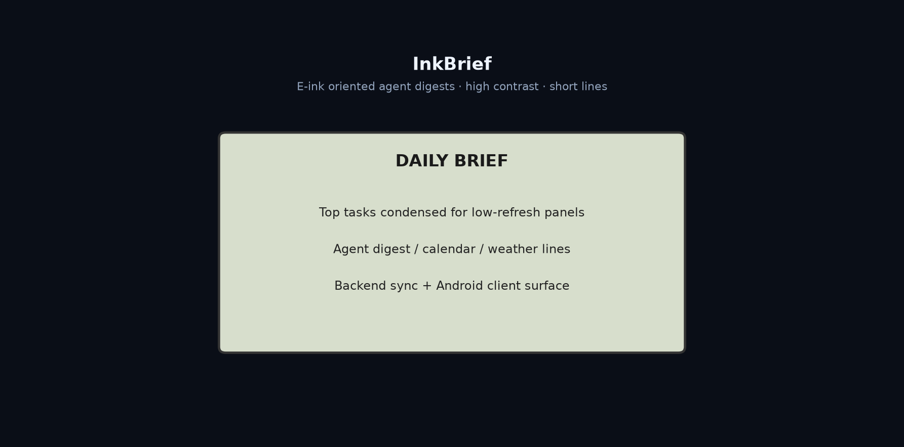

# InkBrief

**Lightweight e-ink agent brief sync — backend + Android client for high-contrast short digests.**

[English](README.md) | [中文](README.zh-CN.md)

[](https://github.com/Phoenix0531-sudo/InkBrief/actions/workflows/ci.yml)
[](LICENSE)

## Preview



## Layout

```
android/ backend/ tools/ horizon/ docs/ tests/
```

## Get started

```bash
git clone https://github.com/Phoenix0531-sudo/InkBrief.git
cd InkBrief
# follow backend/ and android/ docs
pytest tests/ 2>/dev/null || true
```

## Firewall (Windows)

If the Kindle cannot reach the backend on LAN, add an inbound rule for
port 8720. Open **PowerShell as Administrator** and run:

```powershell
New-NetFirewallRule -DisplayName 'InkBrief 8720' -Direction Inbound -Protocol TCP -LocalPort 8720 -Action Allow -Profile Any
```

## License

MIT. See [LICENSE](LICENSE).
