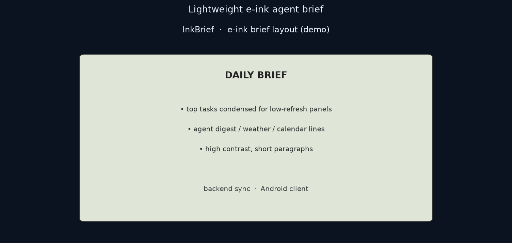

# InkBrief

**轻量墨水屏 Agent 同步简报：后端 + Android 界面。**

[English](README.md) | [中文](README.zh-CN.md)

[](https://github.com/Phoenix0531-sudo/InkBrief/actions/workflows/ci.yml)
[](LICENSE)

面向低刷新面板的短而高信噪比摘要。

## 预览



## 功能

- 墨水屏友好的简报呈现
- backend/ + android/ 客户端树
- tools/ 与 horizon 参考
- 核心检查 CI

## 快速开始

### 安装

```bash
git clone https://github.com/Phoenix0531-sudo/InkBrief.git
cd InkBrief
# follow backend/ and android/ docs
```

### 使用

启动 backend 服务后连接 Android 客户端。见 docs/。

## 项目结构

```
android/  backend/  tools/  horizon/
```

## 说明

硬件约束驱动 UX。

## 许可证

MIT。在注明出处的前提下可商业使用（以 LICENSE 为准）。详见 [LICENSE](LICENSE)。
